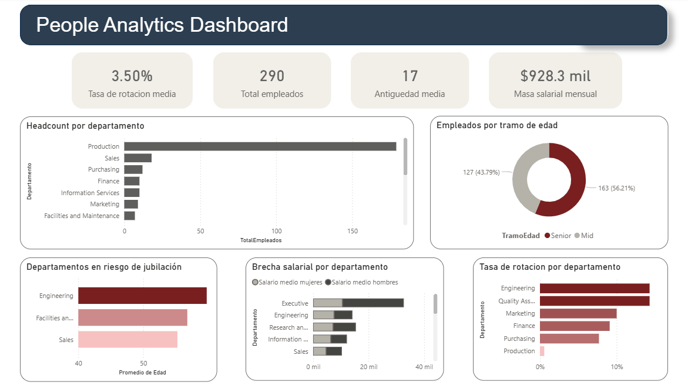

# people_analytics
Análisis de plantilla con SQL avanzado + Dashboard Power BI

## Descripción
Análisis del estado de la plantilla de AdventureWorks para apoyar la planificación 
anual de RRHH, identificar riesgos organizativos y optimizar la gestión del talento.

El proyecto responde 7 preguntas clave de negocio usando SQL avanzado sobre la base 
de datos AdventureWorks2022 de Microsoft SQL Server, y visualiza los resultados en un 
dashboard ejecutivo interactivo construido en Power BI.

---

## Dashboard



El dashboard consolida los principales KPIs de RRHH en una única página ejecutiva 
con 2 filtros interactivos (Departamento, Género) que actúan sobre todos los 
visuales simultáneamente.

**KPIs principales:**
- Headcount total: 290 empleados activos
- Antigüedad media: 17 años
- Masa salarial mensual: $928K
- Tasa de rotación media: 3.50%

---

## Preguntas de negocio
1. ¿Cómo está distribuida la plantilla?
2. ¿Cuál es la antigüedad media por departamento?
3. ¿Cuál es la masa salarial mensual por departamento?
4. ¿Existe brecha salarial entre géneros?
5. ¿Cuál es la tasa de rotación histórica?
6. ¿Cuál es el perfil de edad de la plantilla?
7. ¿Qué empleados llevan más tiempo en la empresa?

---

## Tecnologías
- Microsoft SQL Server 2022
- SQL Server Management Studio (SSMS)
- T-SQL
- Power BI Desktop

---

## Técnicas SQL utilizadas
- Window Functions — ROW_NUMBER, SUM OVER, PARTITION BY
- CTEs encadenadas — hasta 2 CTEs en una sola query
- JOINs múltiples — hasta 4 tablas en una sola query
- PIVOT con CASE WHEN — brecha salarial por género y departamento
- ROW_NUMBER para salario más reciente — evita duplicados en historial de pagos
- Segmentación por tramos de edad — Junior / Mid / Senior
- Views SQL — modelo en estrella para alimentar Power BI

---

## Arquitectura del proyecto

El proyecto se estructura en tres capas:

**1. Análisis SQL** (`people_analytics.sql`)  
7 queries analíticas que responden las preguntas de negocio con técnicas avanzadas de T-SQL.

**2. Capa de datos para Power BI** (`views/`)  
3 views SQL que implementan un esquema optimizado para el dashboard:

| View | Descripción |
|------|-------------|
| `vw_fact_empleados` | Empleado activo con antigüedad, edad y tramo |
| `vw_fact_salarios` | Salario más reciente por empleado con género |
| `vw_dim_departamento` | Departamentos con tasa de rotación histórica |

**3. Dashboard Power BI** (`dashboard.pbix`)  
7 medidas DAX sobre el modelo con 7 visuales interactivos.

---

## Hallazgos principales

### Distribución de plantilla
- **Production** concentra el **61.72% de la plantilla** con 179 empleados
- La distribución es muy desigual — el resto de departamentos no supera los 18 empleados
- Oportunidad: diversificar la estructura organizativa para reducir dependencia de un solo departamento

### Antigüedad
- **Engineering** y **Shipping** lideran con **17.26 años** de media
- **Sales** es el departamento más joven con **14.34 años** de media
- La antigüedad media global de **17 años** indica una plantilla muy consolidada

### Masa salarial
- **Production** concentra el **48% de la masa salarial** total
- **Sales** tiene el **10% de masa salarial** con solo el **6% del headcount** — empleados de alto valor
- La masa salarial mensual total asciende a **$928K**

### Brecha salarial
- **Executive** tiene la mayor brecha a favor de hombres — **$11,511/mes** de diferencia
- **Engineering** y **Human Resources** tienen brecha a favor de mujeres
- **Production Control** y **Quality Assurance** tienen un solo género — no hay brecha calculable

### Tasa de rotación
- **Engineering** y **Quality Assurance** lideran con **14.29%** de rotación histórica
- La rotación general es baja — plantilla estable y consolidada
- Riesgo: Engineering combina alta rotación con edad media elevada

### Perfil de edad
- **56.21% Senior** (más de 45 años) y **43.79% Mid** (30-45 años)
- **0% Junior** — no hay talento nuevo en la organización
- **Engineering** tiene la edad media más alta con **~59 años** — riesgo de jubilaciones en cadena
- Solo 3 departamentos superan los 55 años de media: Engineering, Facilities and Maintenance y Sales

### Empleados más veteranos
- **Guy Gilbert** es el empleado más antiguo con **19.78 años**
- La antigüedad no está correlacionada con el salario — riesgo de desmotivación en perfiles senior

---

## Conclusiones y recomendaciones

**1. Plan de captación de talento junior** — el 0% de empleados menores de 30 años es una alerta crítica. Sin renovación generacional la organización perderá conocimiento en los próximos años.

**2. Plan de sucesión en Engineering** — edad media de ~59 años y rotación del 14.29%. Es prioritario identificar y formar sustitutos antes de que se produzcan jubilaciones en cadena.

**3. Revisar brecha salarial en Executive** — $11,511/mes de diferencia entre géneros es significativo y supone un riesgo reputacional y legal.

**4. Retención de perfiles senior** — la antigüedad no correlaciona con el salario. Implementar un modelo de compensación que reconozca la veteranía reduciría el riesgo de fuga de conocimiento.

**5. Diversificar la estructura de plantilla** — el 61.72% concentrado en Production hace la organización vulnerable a cambios en ese departamento.

---

## Estructura del repositorio

```
people_analytics/
│
├── people_analytics.sql     # 7 queries analíticas con hallazgos comentados
├── views/
│   ├── vw_fact_empleados.sql
│   ├── vw_fact_salarios.sql
│   └── vw_dim_departamento.sql
├── dashboard.pbix            # Dashboard Power BI
├── dashboard.png             # Captura del dashboard
└── README.md
```

---

## Autor
Jorge Torres  
[GitHub](https://github.com/Jorgetorres1909)
